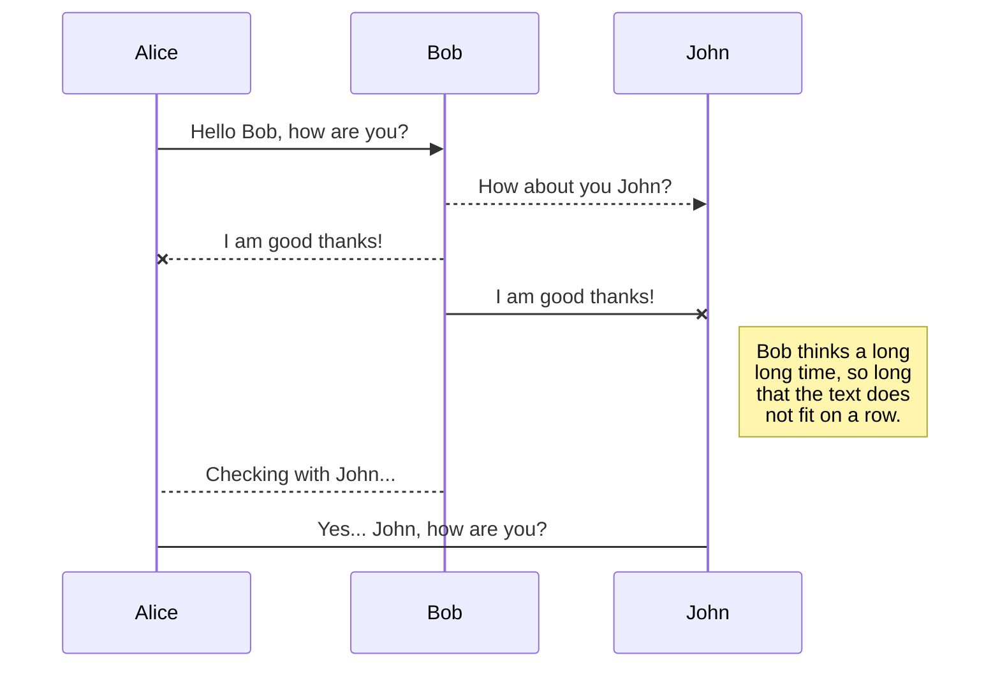
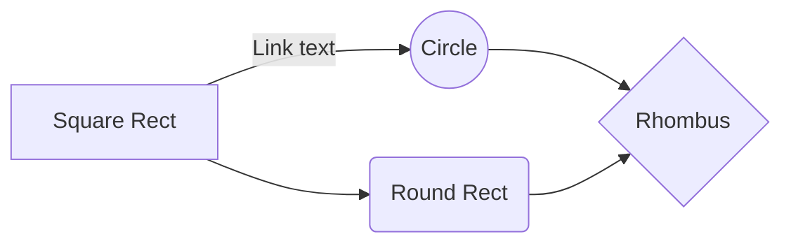

# Microsoft 365 Reporting using Graph!

Hi! I'm Steve and I do a lot of work with putting together reports on M365 Tenants. I wanted to take the time to share some of the work I do so others can consider leveraging the approach. 

My goal was to look at collecting data from **M365** using **Graph** where possible. Then, once the data was collected to store the data in a SQL store (Azure SQL or on prem SQL).

Once the data is saved in SQL, I use Power BI to develop reports using this data. 

The real challenge is in the collection and storage of the data. The good news is Graph does a great job of making it easier collecting large sets of data. I often target data sets that could return 100's of thousands of rows, and Graph can work with it. Graph is also pretty good and querying and filtering the data.

## M365 Reporting Architecture
I use the below components to collect and store data from M365.

##### M365 Reporting - Cloud SQL

### The components

#### Microsoft Graph
Graph is used as the interface to the M365 applications. Graph provides a standardised aproach to querying cloud data using REST queries. I'll talk plenty more about Graph in this series.

#### Azure Automation
The next component of the architecture is the mechanism for collecting data. You can collect data using on prem servers and using scheduled tasks, or you can collect data using Azure Automation run books. Both approaches have pros and cons but are equally effective. Azure Automation provides a great framework for running jobs in Azure and is pretty easy to get your head across. One of the nice things  I like about Azure Automation is you can use either Powershell or Python to create your runbooks, so you can use which scripting language works best for you.

#### Azure AD
We need AD of course for our authentication and authorisation mechanism. We will use an App Registration Id to retrieve a token from Azure AD that then can be used against Graph to authenticate and authorise our queries.

#### App Registrations
App Registrations are a super important part of the architecture. You can create App Registrations to grant your applications the rights to read (and update) data in your tenant. The App Registrations are also really powerful in the sense that you can provide very granular permissions to your App Registration. For example you might grant the App Registration read permissions to channels within Microsoft Teams.

#### Azure Key Vault
I use an Azure Key Vault to store the secret for the App Registration, so I don't need to store any secrets (effectively a password) in my code.

#### Azure SQL Server

Of course once we have retrieved the data using Graph, we need to store it somewhere for reporting later on. I like SQL Server, although of course there are plenty of data storage options. I like SQL Server as I have used it for a long time, and the SQL Server system has a lot of power that can be leveraged to filter and join data together.

#### Power BI
Last but not least is Power BI which gives us a great way of presenting the data in a professional way. One of the great things about Power BI is you don't have to be a developer to put together great looking reports. Once the data is in SQL, it is really easy to pull the data from the DB and quickly start producing meaningful reports.

## On Premises M365 Reporting Infrastructure

Sometimes using Azure Automation or Azure SQL might not work for you and your business. So you might want to keep more of the solution components in on prem infrastructure.

The main differences between the on prem and cloud architectures include:
- Management Servers vs Azure Automation - You might want to run your scripts via Management servers on prem. I work for a few customers who do it this way as they use these On Prem servers to manage M365, and so adding some Scheduled Tasks to kick off some regular scripts is an easy addition.
- On prem SQL Server - If you want to store your data in a on prem SQL then as is also an easy change. SQL On Prem or in the cloud work in mostly the same ways. The syntax to interface with SQL is going to be the same. You might go with an on prem DB if you have existing SQL Servers or use an on prem Data Warehouse.

You'll still need an Azure App Registration, and a Azure Key Vault and of course Graph, but moving to Management Servers and on prem SQL may work better for you.

### Service Accounts

You'll also need a service account that will be used to access the Azure Key Vault and retrive the secret items. Additionally, you may also be unable to collect certain data via Graph and so may need to use the application specific PowerShell modules. A service account may be required to execute the cmdlets. Wherever possible though I will attempt to use an App Registration. The key thing is though you will need a service account to access Azure AD and your Azure Key Vault.

# Querying data with Graph

The first thing you'll need when you want to start experimenting with querying data via Graph is to create an App Registration. Start simple and only add a couple of permissions. A good permission to start experimenting with might be User.Read.All, and then you can investigate querying user data in Azure AD.

Refer to the following article to find out more about creating an App Registration. [Register an app in the Microsoft Identity Platform](https://docs.microsoft.com/en-us/azure/active-directory/develop/quickstart-register-app)

> Before starting to publish, you must link an account in the **Publish** sub-menu.

## Publish a File

You can publish your file by opening the **Publish** sub-menu and by clicking **Publish to**. For some locations, you can choose between the following formats:

- Markdown: publish the Markdown text on a website that can interpret it (**GitHub** for instance),
- HTML: publish the file converted to HTML via a Handlebars template (on a blog for example).

## Update a publication

After publishing, StackEdit keeps your file linked to that publication which makes it easy for you to re-publish it. Once you have modified your file and you want to update your publication, click on the **Publish now** button in the navigation bar.

> **Note:** The **Publish now** button is disabled if your file has not been published yet.

## Manage file publication

Since one file can be published to multiple locations, you can list and manage publish locations by clicking **File publication** in the **Publish** sub-menu. This allows you to list and remove publication locations that are linked to your file.

# Markdown extensions

StackEdit extends the standard Markdown syntax by adding extra **Markdown extensions**, providing you with some nice features.

> **ProTip:** You can disable any **Markdown extension** in the **File properties** dialog.

## SmartyPants

SmartyPants converts ASCII punctuation characters into "smart" typographic punctuation HTML entities. For example:

|                |ASCII                          |HTML                         |
|----------------|-------------------------------|-----------------------------|
|Single backticks|`'Isn't this fun?'`            |'Isn't this fun?'            |
|Quotes          |`"Isn't this fun?"`            |"Isn't this fun?"            |
|Dashes          |`-- is en-dash, --- is em-dash`|-- is en-dash, --- is em-dash|

## KaTeX

You can render LaTeX mathematical expressions using [KaTeX](https://khan.github.io/KaTeX/):

The *Gamma function* satisfying $\Gamma(n) = (n-1)!\quad\forall n\in\mathbb N$ is via the Euler integral

$$
\Gamma(z) = \int_0^\infty t^{z-1}e^{-t}dt\,.
$$

> You can find more information about **LaTeX** mathematical expressions [here](http://meta.math.stackexchange.com/questions/5020/mathjax-basic-tutorial-and-quick-reference).

## UML diagrams

You can render UML diagrams using [Mermaid](https://mermaidjs.github.io/). For example, this will produce a sequence diagram:

And this will produce a flow chart:

